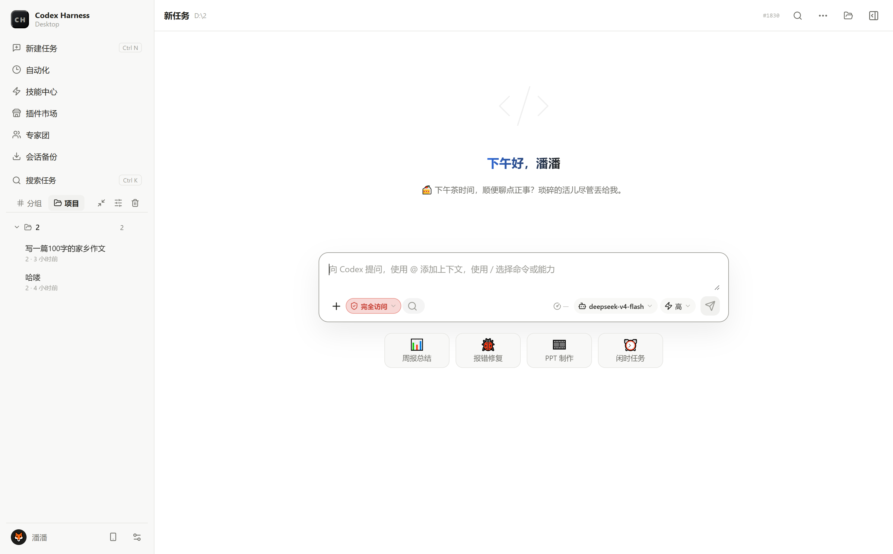
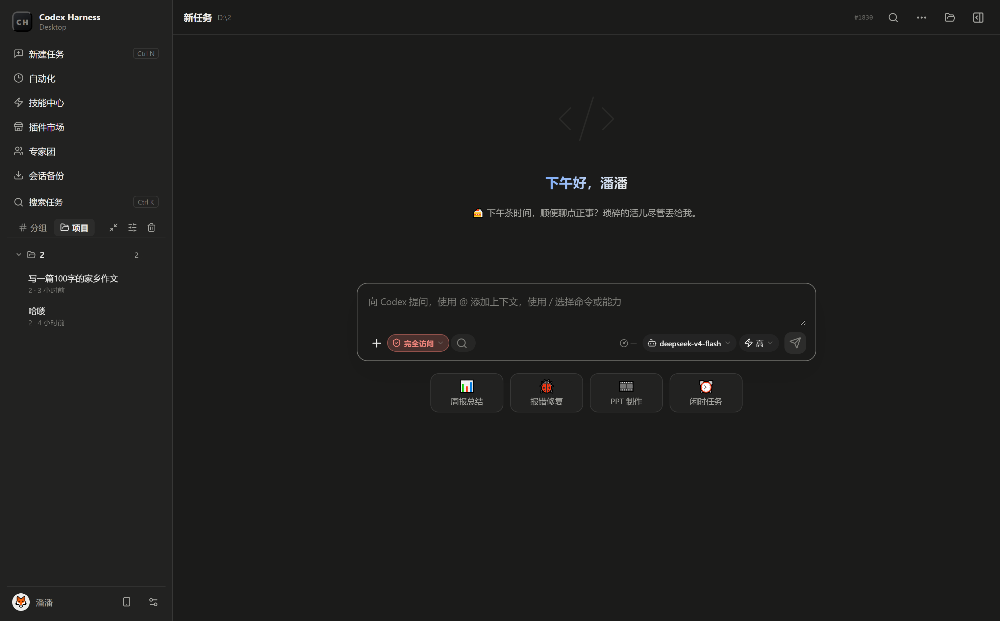
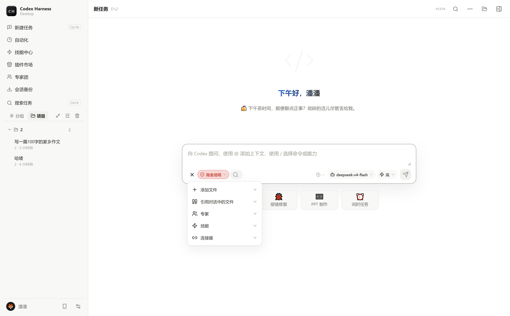

# Codex Harness Desktop

独立桌面工作台，把 OpenAI Codex 引擎装进一个真正的桌面应用：多会话任务管理、可视化 diff 审阅、内置自动化工具、插件/技能/连接器生态、专家团队协作，开箱即用，无需命令行。

<p align="center">
  
</p>

## ✨ 功能特性

### 🚀 任务与会话管理
- **多任务并行**：侧栏按分组/项目管理会话，支持置顶、归档、重命名、分支、批量操作
- **消息排队**：任务运行中继续输入，消息自动排队依次发送
- **会话备份与导出**：本地 Markdown 导出、跨设备恢复
- **移动远程接入**：手机扫码远程连接工作台，微信/飞书/Telegram/Lark/钉钉等 Bot 通道消息驱动任务

### 🎨 沉浸式对话体验
- **流式平滑渲染**：正文/深度思考逐字平滑揭示，无跳字闪烁
- **会话折叠**：工具调用、计划步骤自动折叠成卡片，长任务一眼看清结构
- **提示词增强**：输入框一键 AI 润色提示词（悬停预览、一键还原）
- **引用体系**：`@` 引用上下文、引用会话/文件、图片内联粘贴

### 🔌 能力生态
- **技能中心**：一键安装社区技能到引擎，市场分类浏览
- **插件市场**：生图/视觉/RPA 等内置插件，能力开关总闸一键管控
- **连接器（MCP）**：飞书/钉钉/腾讯文档等 MCP 服务器可视化配置
- **专家团队**：可组建多角色专家团，成员一键直达会话协作

### 🛠 自动化工具箱（内置，开箱即用）
- **桌面自动化**：截屏/键鼠/窗口控制/OCR 感知
- **浏览器自动化**：Playwright CLI + 反检测指纹浏览器（过 Cloudflare/reCAPTCHA）
- **内置运行时**：Node/Python/Git/PowerShell/rg/cmake 等全套工具链，首次启动按需下载
- **终端**：xterm 内置终端，会话级持久化

### ⚙️ 工程化细节
- **权限分级**：只读/自动编辑/完全访问三档审批，敏感操作确认执行
- **沙箱隔离**：Windows 沙箱执行，命令越界走审批流
- **多模型接入**：任意 OpenAI 兼容端点，多供应商多模型自由切换，思考强度按模型能力自适应
- **记忆分层**：用户档案/项目记忆/会话日志三层记忆体系，自动沉淀
- **应用内自更新**：内置版本发布中心对接，检查/下载/安装一体化

<p align="center">
  
  
</p>

## 📦 下载安装

前往 [Releases](../../releases) 页面下载：

| 平台 | 文件 | 说明 |
|---|---|---|
| Windows 10/11 x64 | `Codex-Harness-Setup-<版本>.exe` | NSIS 安装向导，可选安装目录 |
| macOS Intel | `Codex Harness Desktop-<版本>-x64-mac.zip` | 解压后拖入「应用程序」 |
| macOS Apple Silicon (M1/M2/M3/M4) | `Codex Harness Desktop-<版本>-arm64-mac.zip` | 解压后拖入「应用程序」 |

> 首次启动会按需下载引擎与工具链运行时（可选），国内网络建议保持默认配置。

**macOS 首次打开**（安装包未做开发者签名，Gatekeeper 会拦截）：

1. 解压后把 App 拖进「应用程序」
2. **右键 → 打开**（不要直接双击），弹窗中点「打开」
3. 若仍提示已损坏，终端执行：

```bash
xattr -cr "/Applications/Codex Harness Desktop.app"
```

## 🛠 从源码构建

```bash
git clone https://github.com/<YOUR_ACCOUNT>/codex-harness-desktop.git
cd codex-harness-desktop
npm install

# 开发模式
npm run dev

# 构建 Windows 安装包（NSIS）
npm run dist

# macOS 包：在 macOS 机器上执行，或用仓库内 GitHub Actions 云端构建
# （Actions → Build macOS → Run workflow，同时产出 arm64 与 x64 两个 zip）
CSC_IDENTITY_AUTO_DISCOVERY=false npx electron-builder --mac zip --arm64   # 或 --x64
```

内置工具链（Node/Python/Git 等）不随源码分发：Windows 上首次启动会引导下载；也可手动执行 `node scripts/install-runtimes.cjs` 预先拉取。

## 🏗 技术栈

- **Electron 43** + **React 19** + **Vite 8** + **TypeScript 5.9**
- 引擎通信：stdio JSON-RPC 对接 `@openai/codex` app-server
- 终端：`@lydell/node-pty` + `@xterm/xterm`
- 远程通道：SSH2 / Telegram / 微信 / 飞书 / 钉钉网关

## 📁 目录结构

```
├── electron/          # 主进程（引擎 RPC、窗口、网关、更新）
├── src/               # 渲染层（React 界面、hooks、纯函数库）
├── scripts/           # 构建/校验/运行时安装脚本
├── release-site/      # 配套版本发布中心（Node 服务端，可选部署）
├── build/             # 应用图标源文件
└── docs/screenshots/  # 界面截图
```

## 📋 系统要求

- Windows 10 1809+ / macOS 12+（Intel 或 Apple Silicon）
- 需要能访问所配置的模型 API 端点

## 💬 反馈与交流

遇到 Bug 或有好想法，欢迎通过以下渠道告诉我们：

| 渠道 | 地址 | 说明 |
|---|---|---|
| 🐛 GitHub Issues | [提交 Bug / 建议](../../issues) | 带结构化表单，方便快速定位 |
| 💬 官网反馈页 | [www.jvszzp.ltd/feedback.html](https://www.jvszzp.ltd/feedback.html) | 支持截图上传，无需 GitHub 账号 |
| 📦 下载与更新 | [www.jvszzp.ltd](https://www.jvszzp.ltd) | 最新版本与更新日志 |

## ⚠️ 免责声明

本项目是对 OpenAI Codex CLI 的独立桌面封装，与 OpenAI 官方无隶属关系。使用本项目产生的 API 调用费用由用户自行承担。请遵守所在地区法律法规及 OpenAI 使用条款。

## 💝 赞助支持

如果你觉得这个项目有用，欢迎通过赞助商支持我们，助力持续开发：

<p align="center">
  <a href="https://api.pptoken.cc/register?aff=X82JSNVC3W3S" style="display:inline-block;padding:12px 32px;background:linear-gradient(135deg,#8b5cf6,#6366f1);color:#fff;border-radius:10px;font-size:15px;font-weight:600;text-decoration:none">💝 立即注册支持我们 →</a>
  <br><br>
  <em>https://api.pptoken.cc/register?aff=X82JSNVC3W3S</em>
</p>

## License

[MIT](LICENSE)
