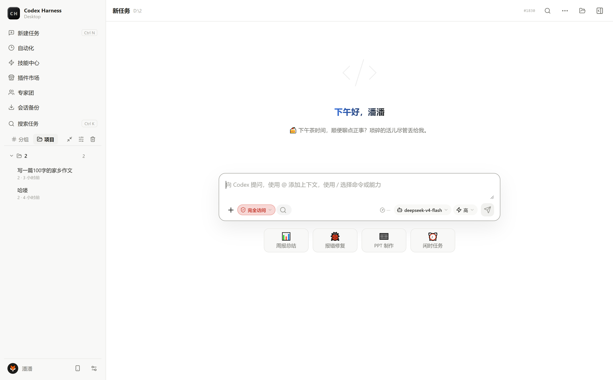

# Codex Harness Desktop

独立桌面工作台，把 OpenAI Codex 引擎装进一个真正的桌面应用：多会话任务管理、可视化 diff 审阅、内置自动化工具、插件/技能/连接器生态、专家团队协作，开箱即用，无需命令行。

<p align="center">
  
</p>

## 🆕 最新更新 v0.0.29

- **组件库**：内置 Uiverse 3800+ 现成 HTML/CSS 组件，浏览/复制即用，Codex 写前端自动查库
- **桌面宠物**：兼容 Codex 官方 pet.json 格式的桌面浮窗宠物，状态跟着任务走
- **像素办公室**：专家团成员实时映射成虚拟办公室（工位、打字动画、休息活动）
- **思考等级自动档**：Laya 本地模型 33ms 自动选 低/中/高/极高，手选立即覆盖
- **插件市场**：换源 Gitee 官方镜像（48 个兼容插件），名称与简介全中文
- **首启引导 2.0**：只弹「开发工具」引导，工具安装国内镜像加速、进度/速度/并行队列

## 🎯 核心能力速览

| | 能力 | 一句话说明 |
|---|---|---|
| 🗂️ | **多会话并行与排队** | 分组/置顶/归档/分支/批量操作；运行中继续输入自动排队 |
| 🎞️ | **沉浸式对话体验** | 逐字平滑揭示、长会话自动折叠、AI 润色提示词、`@` 引用、图片内联粘贴 |
| 🎙️ | **本机离线语音通话** | 悬浮球一键通话，识别与合成全在本机，零凭据零联网 |
| 🔑 | **OpenAI 官方订阅** | ChatGPT 设备码登录即用，多账号切换，额度实时同步 |
| 🔀 | **多模型与中转站** | 任意 OpenAI 兼容端点自由接入；中转站多账号一键切换 |
| 🧩 | **技能 · 插件 · MCP 生态** | 技能/插件/MCP 三个市场：详情预览 + 一键安装直连引擎 |
| 🖥️ | **桌面与浏览器自动化** | 键鼠/截屏/OCR + Playwright 浏览器自动化，随包预装开箱即用 |
| 🧭 | **内置浏览器与项目树** | 右侧面板边聊边浏览；项目树多标签预览、可编辑保存 |
| 📈 | **超长上下文** | 视口外跳过渲染 + 分页懒加载，几个 G 历史也流畅 |
| 🛡️ | **权限分级与沙箱** | 只读/自动编辑/完全访问三档审批，会话中途切换即时生效 |

**还有**：专家团并行调度 · 审批卡一行不占屏 · 会话切换缓存直渲 · 大 diff 行级虚拟化 · 三层记忆自动沉淀 · 微信/Telegram/飞书/钉钉/QQ Bot 远程接入 · xterm 内置终端 · 会话备份导出 · 应用内自更新 · 浅色/深色主题。

## ✨ 功能特性

### 🚀 任务与会话管理
- **多任务并行**：侧栏按分组/项目管理会话，置顶、归档、重命名、分支、批量操作
- **消息排队**：运行中继续输入自动排队依次发送，≥2 条可折叠、可拖动调整顺序
- **会话绝对独立**：切会话、开弹窗、改配置都不会打断正在跑的任务
- **会话级模型/思考档位/权限**：每个会话各记各的，多窗口并发不丢配置；换模型下一条消息立即生效
- **统一内置通道**：切换供应商零迁移，旧会话自动接力，历史完整保留
- **超长上下文**：分页懒加载（打开只渲染最近 5 回合，往上滚自动续载），≥70% 一键压缩、≥80%/≥95% 预警
- **计划可编辑**：Codex 的执行计划可勾选、改文字、增删，改完发回执行
- **评审子智能体**：用干净上下文复审 Codex 的成果，报错前自审去误报
- **文档附件**：PDF/Word/Excel/PPT 拖进对话转成 Markdown 正文（markitdown，本机转换不上传）
- **内置写作技能**：humanizer / no-ai-slop / i-have-adhd（MIT，可单独停用）
- **语气自适应**：agent 心情/精力随回合结果变化，只影响说法不影响内容（可关闭）
- **输入体验**：草稿按会话独立保存；文件/图片内联 chip；粘贴超 200 字自动转 .txt；`#` 引用技能
- **隐私与安全**：可信根沙箱、密钥 safeStorage 加密落盘、本地服务只绑 127.0.0.1、无遥测
- **会话备份与导出**：Markdown 导出、跨设备恢复

### 🎨 沉浸式对话体验
- **组件库**：设置 →「组件库」，Uiverse 3800+ 现成组件按类目浏览、点开看代码一键复制；Codex 写前端自动查库
- **桌面宠物**：官方 pet.json 格式浮窗宠物（内置三只），空闲/运行/等待/失败等九种姿态实时切换
- **像素办公室**：专家团成员实时映射成虚拟办公室——工位落座、打字动画、喝水/查资料休息活动
- **内置浏览器**：右侧面板多标签浏览，隐身浏览走指纹内核（过反爬）
- **流式平滑渲染**：正文/思考逐字揭示；工具调用、深度思考自动折叠成卡片
- **会话切换秒开**：缓存直渲 + 阅读位置还原（实测 P50 20ms）
- **提示词增强**：输入框一键 AI 润色，悬停预览、一键还原
- **图片体验**：点击放大灯箱（滚轮缩放）、悬停小预览、复制图片、打开所在位置
- **项目树**：多标签预览、行号常开、语法高亮、直接编辑保存、HTML 一键浏览器打开
- **大模型文件下载更稳**：多镜像轮换 + 断点续传 + 卡死判定

### 📱 移动端远程控制
- **手机扫码即控**：扫码后在手机上查看会话、收发消息（Cloudflare 隧道优先，回退局域网）
- **两道安全关**：6 位配对码 + 电脑端审批；已批准设备免重复配对，可随时移除
- **机器人同样要配对**：微信/QQ/飞书/钉钉/Telegram 首次对话先发授权码

### 🎙️ 本机离线语音通话
- **一键通话**：悬浮球点击即通话，实时字幕、开口即打断；应用内来电式通话界面
- **全本机推理**：识别与合成本机跑（sherpa-onnx），零凭据零联网，模型按需下载（约 270MB）
- **语音唤醒**：内置 KWS 关键词模型，说唤醒词即唤起
- **音色**：内置精选音色可试听；支持导入/录制音频克隆专属音色（ZipVoice 按需下载）
- **听写**：输入框麦克风按钮，说话实时进输入框；引擎能区分语音消息与打字消息

### 🔌 能力生态
- **OpenAI 官方订阅**：设备码登录免 API Key，多账号批量管理，额度实时同步
- **中转站中心**：sub2api 兼容，多账号一键切换，余额/套餐实时透出
- **技能中心**：SkillHub 市场 280+ 技能，一键安装，英文描述统一中文化
- **插件市场**：Gitee 官方镜像（Claude Code 官方市场中国版，48 个兼容插件），名称简介全中文，一键安装
- **专家市场 / 人格市场**：55 个专家包、16 套人格一键应用
- **连接器（MCP）**：飞书/钉钉/腾讯文档等可视化配置 + MCP 市场 27 个服务
- **专家团队**：多角色专家团按 SOP 编排，并行阶段整组同时干活，头像轨看进度
- **会话级调度**：Codex 可把子任务委派给专家/子智能体，四层防护防套娃

### 🛠 自动化工具箱（开发工具页按需下载）
- **桌面自动化**：截屏/键鼠/窗口控制/OCR（Nuphus 随包预装），视觉识图已接通
- **浏览器自动化**：Playwright CLI + 反检测指纹浏览器（随包预装），内核按需下载
- **RPA 流程自动化**：跑通的流程一键存为配方随时复现
- **基础运行时**：Node/VS Code CLI 随包；Python/Git/PowerShell 等「开发工具」按需下载（国内镜像优先，缺 Git 首启自动补装）
- **终端**：xterm 内置终端，会话级持久化

### ⚙️ 工程化细节
- **权限分级**：只读/自动编辑/完全访问三档，敏感操作确认执行
- **MCP 逐工具权限**：允许/需批准/拒绝三档，拒绝=真阻断（写进引擎 disabled_tools）
- **多模型接入**：任意 OpenAI 兼容端点；协议自动适配（Responses ↔ Chat Completions），Chat 网关直接用
- **思考等级**：低/中/高/最高/极高五档跟模型保存；**自动档**由本地 Laya 模型 33ms 判定，手选立即覆盖
- **供应商管理**：启用/停用状态药丸、连接自检带排查清单、模型参数内置规格表自动填
- **应用内自更新**：GitHub Releases 单源，检查/下载/安装一体化

## 📦 下载安装

前往 [Releases](../../releases) 页面下载：

| 平台 | 文件 |
|---|---|
| Windows 10/11 x64 | `Codex.Harness.Desktop-<版本>-win-x64.exe` |
| macOS Apple Silicon (M1-M4) | `Codex.Harness.Desktop-<版本>-arm64-mac.zip` |
| macOS Intel | `Codex.Harness.Desktop-<版本>-x64-mac.zip` |

> 选哪个包：苹果菜单 →「关于本机」→ 芯片写 **Apple M1/M2/M3/M4** 选 arm64，写 **Intel** 选 x64。建议留 **10 GB** 磁盘空间（解压与首次启动还要下载运行时）。

**macOS 首次打开**（安装包未签名，Gatekeeper 会拦）：

1. **在「下载」里解压**（别在「应用程序」里解压，会报错误 640）；报 640 就用终端：`cd ~/Downloads && ditto -x -k "<zip 文件名>" .`
2. 把 App **拖进「应用程序」**（别在「下载」里直接双击运行）
3. **右键 → 打开**（不要直接双击）
4. 仍提示「已损坏」时，终端执行（App 图标拖进终端自动填路径）：

```bash
xattr -cr "/Applications/Codex Harness Desktop.app"
```

> 基础运行时不再整体内置：仅 Node 与 VS Code CLI 随包，其余在「开发工具」页按需下载（国内镜像优先、失败回落官方源）。缺必需工具时首启自动弹「环境体检」一键补齐。

## 🛠 从源码构建

```bash
git clone https://github.com/<YOUR_ACCOUNT>/codex-harness-desktop.git
cd codex-harness-desktop
npm install
npm run dev        # 开发模式
npm run dist       # Windows 安装包（NSIS）
```

⚠️ `resources/tools/*` 不在 git 里（大体积二进制），干净检出构建前由 `scripts/prepare-windows-tools.cjs` / `prepare-mac-tools.cjs` 现造；打包后用 `node scripts/verify-packaged-tools.cjs <产物 tools 目录>` 验收。

## 🚀 发版（推 tag 即发布）

发布渠道只有 GitHub Releases，构建与发布全部在 CI（`.github/workflows/release.yml`）：

```bash
# ① 版本对齐：package.json / package-lock.json / electron/codex-server.ts clientInfo
# ② 写更新说明：docs/releases/v<版本>.md（应用内更新弹窗展示）
npm run check                          # ③ 离线预检全绿
git push origin HEAD:refs/heads/main   # ④ 推代码
git push origin v<版本>                # ⑤ 推 tag → 触发三端构建并发布
```

发版前必做 **mac 适配审计**：`node scripts/mac-audit.mjs <上一版 tag>` 扫描新增行的平台敏感模式，逐条判读后把结论写进发版说明的 macOS 段。资产命名是更新器契约（mac 包必须含 `mac`+`.zip`+架构名），名字错了用户端静默显示「已是最新」。

## 🧪 验证与测试

本项目硬性要求：**任何源码改动必须以自动验收全绿为完成标准**。

```bash
npm run verify   # = npm run check（离线预检）+ npm run e2e（拉起应用跑验收项）
```

- `npm run check`：构建 + IPC 桥一致性 + 纯函数行为断言，毫秒级不需要图形界面
- `npm run e2e`：CDP 驱动真实应用跑验收，默认只跑最新一轮，失败自动截图（`.e2e-artifacts/shots/`）
- 改了哪个模块就给 `scripts/guards/` 对应域文件加可保留的检查项；真链路证据每轮现写、跑完即删
- 看全新用户首启：`npm run preview:fresh`（前台运行，不碰真实配置）

详见 [`docs/TESTING.md`](docs/TESTING.md)。

## 🏗 技术栈

- **Electron 43** + **React 19** + **Vite 8** + **TypeScript 5.9**
- 引擎通信：stdio JSON-RPC 对接 `@openai/codex` app-server
- 终端：`@lydell/node-pty` + `@xterm/xterm`

## 💾 数据与更新

所有用户数据存放在 `%APPDATA%\Codex Harness Desktop\`（macOS 为 `~/Library/Application Support/`），更新应用或引擎都不会丢失。

## 📋 系统要求

- Windows 10 1809+ / macOS 12+（Intel 或 Apple Silicon）
- 至少 10 GB 可用磁盘空间，建议 8 GB 及以上内存
- 需要能访问所配置的模型 API 端点

## 💬 反馈与交流

| 渠道 | 地址 |
|---|---|
| 🐛 GitHub Issues | [提交 Bug / 建议](../../issues) |
| 💬 官网反馈页 | [www.jvszzp.ltd/feedback.html](https://www.jvszzp.ltd/feedback.html) |
| 📦 下载与更新 | [GitHub Releases](../../releases)（唯一更新源） |

## ⚠️ 免责声明

本项目是对 OpenAI Codex CLI 的独立桌面封装，与 OpenAI 官方无隶属关系。使用本项目产生的 API 调用费用由用户自行承担。请遵守所在地区法律法规及 OpenAI 使用条款。

## 💝 赞助支持

<p align="center">
  <a href="https://api.pptoken.cc/register?aff=X82JSNVC3W3S" style="display:inline-block;padding:12px 32px;background:linear-gradient(135deg,#8b5cf6,#6366f1);color:#fff;border-radius:10px;font-size:15px;font-weight:600;text-decoration:none">💝 立即注册支持我们 →</a>
</p>

## License

[MIT](LICENSE)
